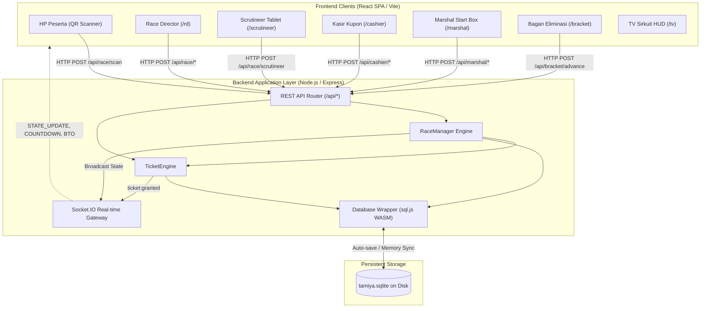

<!-- generated-by: gsd-doc-writer -->
# Architecture Overview: DGDash Racing System

## System Overview
DGDash Racing System adalah sistem manajemen turnamen balap Mini 4WD Tamiya 3-jalur berbasis web real-time yang mengadopsi arsitektur terdistribusi ringan *client-server* berlatensi rendah (<50ms). Sistem ini menggabungkan backend Node.js Express + Socket.IO dengan database embedded SQLite (dikompilasi via WASM melalui `sql.js`) dan antarmuka frontend Single Page Application (SPA) React 18 yang responsif dengan TailwindCSS. Aliran data utama berpusat pada *state machine* balapan terpusat yang menyinkronkan status antara HP peserta, terminal tablet Race Director, Meja Scrutineer, Meja Kasir, Meja Start Box Marshal, dan Layar TV Sirkuit tanpa ketergantungan perangkat keras RFID/NFC fisik.

## Component Diagram



## Data Flow

Siklus data turnamen bergerak melalui tahapan terstruktur berikut:

1. **Pendaftaran Jalur (Kualifikasi Babak 1)**:
   - Peserta memindai QR Code stensil meja start (`LINE A`, `B`, atau `C`).
   - Request dikirim ke `POST /api/race/scan`.
   - `RaceManager.registerLane` memeriksa saldo kupon pengguna dan memastikan jalur belum terisi (optimistic lock). Jika jalur terisi, peserta dialihkan ke antrean berikutnya.
   - Status balapan diperbarui dan di-*broadcast* melalui Socket.IO event `STATE_UPDATE`.

2. **Kunci Balapan & Hitung Mundur**:
   - Race Director menekan tombol "KUNCI BALAPAN" (`POST /api/race/lock`).
   - Sistem memotong 1 kupon secara atomik dari masing-masing pembalap di heat tersebut dan mengunci status ke `locked`.
   - RD memicu hitung mundur (`POST /api/race/countdown/start`), memicu event suara audio manusia 10 s.d. 1 dan overlay HUD di Layar TV.

3. **Pencatatan Waktu & Scrutineering**:
   - RD menginput catatan waktu finish 3 stopwatch fisik ke `POST /api/race/record-times`.
   - Mobil tercepat dikirim ke antrean Scrutineer (`scrutineerQueue`).
   - Juri di meja scrutineering memeriksa fisik mobil dan menentukan `PASS` atau `DQ` (`POST /api/race/scrutineer`).

4. **Penerbitan Tiket & Auto-Seeding Bracket Babak 2**:
   - Pemenang yang lolos (atau dicatat oleh Marshal di Meja Start via `POST /api/marshal/record-winner`) memicu `TicketEngine.grantNextRoundTicket()`.
   - Tiket diterbitkan dengan nomor tiket sekuensial (`T-001`, `T-002`, dst.) dan kuota sisa diperbarui.
   - Pemenang tiket otomatis ditempatkan ke slot kosong pertama di `bracket_matches` Babak 2 (Jalur A $\rightarrow$ Jalur B $\rightarrow$ Jalur C).
   - Event `ticket:granted` dan data `ticketStats` dikirim ke Layar TV untuk memicu modal selebrasi emas dan pembaruan running ticker.

5. **Eksekusi Bracket Eliminasi Berjenjang**:
   - Di Babak 2 dan seterusnya, setiap heat eliminasi 3-jalur memiliki pemenang yang diajukan melalui `POST /api/bracket/advance`.
   - Pemenang otomatis melaju ke babak berikutnya (Babak 3 hingga Grand Final) dengan rasio eliminasi 3:1.

## Key Abstractions

| Abstraksi / Komponen | File Sumber | Peran & Tanggung Jawab |
|----------------------|-------------|-------------------------|
| `RaceManager` | `server/raceManager.js` | Mesin status utama turnamen; mengelola siklus balapan, registrasi jalur, pemotongan kupon, re-race, dan BTO leaderboard. |
| `TicketEngine` | `server/ticketEngine.js` | Mesin penerbitan tiket Babak 2, sequential bracket auto-seeding, all-3-same-lane auto-advance, kuota tiket, dan void rollback. |
| `DatabaseWrapper` | `server/db.js` | Abstraksi SQLite berbasis WASM (`sql.js`) dengan fitur auto-save ke disk, atomic transactions, dan migrasi skema tabel. |
| `RaceContext` | `client/src/context/RaceContext.jsx` | State container terpusat untuk frontend; mengelola koneksi WebSocket, audio synthesizer, haptic feedback, dan modal selebrasi. |
| `BracketDashboard` | `client/src/screens/BracketDashboard.jsx` | Antarmuka bagan eliminasi multi-round 3-jalur dengan filter, pencarian, dan tombol manual/advance pemenang. |
| `MarshalDashboard` | `client/src/screens/MarshalDashboard.jsx` | Dasbor operasional meja start box dioptimalkan layar sentuh tablet untuk line-up cepat dan check-off kupon. |
| `RealtimeTV` | `client/src/screens/RealtimeTV.jsx` | Tampilan siaran 16:9 sirkuit dengan HUD ticker kuota tiket, running text qualifier, dan overlay hitung mundur raksasa. |

## Directory Structure Rationale

```
balapan/
├── client/                     # Frontend Single Page Application
│   ├── src/
│   │   ├── components/         # Komponen UI modular (CyberButton, HUD, modal, dsb.)
│   │   │   ├── marshal/        # Komponen khusus dasbor Marshal Start Box
│   │   │   └── ui/             # Desain sistem Cyberpunk & tombol aksi
│   │   ├── context/            # RaceContext (WebSocket client & audio/haptic state)
│   │   ├── hooks/              # Custom hooks (useHaptic, dsb.)
│   │   ├── screens/            # Halaman utama aplikasi per rute peran
│   │   │   ├── BracketDashboard.jsx     # /bracket
│   │   │   ├── CashierDashboard.jsx     # /cashier
│   │   │   ├── MarshalDashboard.jsx     # /marshal
│   │   │   ├── ParticipantScreen.jsx    # / (Peserta)
│   │   │   ├── RaceDirectorDashboard.jsx# /rd
│   │   │   ├── RealtimeTV.jsx           # /tv
│   │   │   ├── ScrutineerScreen.jsx     # /scrutineer
│   │   │   └── StencilScreen.jsx        # /stencil
│   │   └── utils/              # Sintesis audio suara manusia & chimes
│   ├── package.json            # Konfigurasi frontend React & Vite
│   └── vite.config.js          # Konfigurasi build Vite & proxy server
├── server/                     # Backend API & WebSocket Server
│   ├── tests/                  # Automated test suite (unit, integrasi, e2e)
│   ├── db.js                   # Inisialisasi & wrapper SQLite WASM
│   ├── index.js                # Server entry point, HTTP routing, Socket.IO
│   ├── raceManager.js          # Core tournament state machine
│   └── ticketEngine.js         # Engine tiket babak 2 & eliminasi
├── docker-compose.yml          # Orkestrasi Docker container & volume
├── Dockerfile                  # Multi-stage Dockerfile berbasis Node Alpine
└── package.json                # Root package & test scripts
```

**Rasional Organisasi:**
- **Pemisahan Client & Server**: Frontend dikompilasi secara independen oleh Vite menjadi aset statis murni yang kemudian dilayani oleh Express atau reverse proxy pada mode produksi.
- **Role-Based Screens**: Masing-masing peran di sirkuit (Peserta, RD, Scrutineer, Kasir, Marshal, TV) memiliki screen independen untuk memastikan ergonomi perangkat yang dituju (ponsel, tablet, atau TV layar lebar).
- **Embedded Database Architecture**: Menggunakan SQLite berbasis WASM di dalam kontainer menghilangkan kebutuhan database eksternal yang rumit, memungkinkan sistem dijalankan secara *portable* di laptop panitia atau mini PC sirkuit tanpa koneksi internet.
