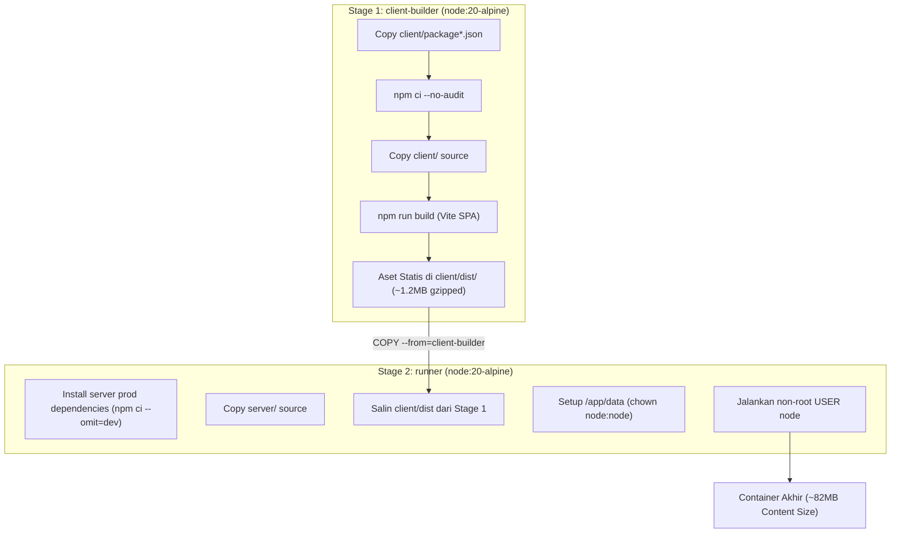

<!-- generated-by: gsd-doc-writer -->
# Deployment & Operations Guide: DGDash Racing System

Panduan penerapan (*deployment*), operasional produksi di arena sirkuit, manajemen kontainer Docker, dan strategi monitoring untuk DGDash Racing System.

## Deployment Targets

1. **Docker & Docker Compose (Production Hardened)**:
   - Target utama untuk sirkuit dan turnamen. Berjalan di atas kontainer mandiri berbasis Alpine Linux dengan user non-root (`node`) dan persistensi volume.
   - Konfigurasi: [Dockerfile](file:///c:/Users/yudhiar/Downloads/oprek/Dev/balapan/Dockerfile) dan [docker-compose.yml](file:///c:/Users/yudhiar/Downloads/oprek/Dev/balapan/docker-compose.yml).
2. **Local Node.js Host**:
   - Menjalankan langsung binary Node.js pada komputer panitia tanpa virtualisasi kontainer.

## Build Pipeline

DGDash Racing System menggunakan arsitektur **Multi-Stage Dockerfile** untuk menjamin keamanan dan efisiensi ukuran berkas:



## Environment Setup

Konfigurasi produksi dikelola melalui file `.env` di direktori proyek:

```env
NODE_ENV=production
HOST_PORT=3050
PORT=3000
DB_PATH=/app/data/tamiya.sqlite
```
*(Lihat [CONFIGURATION.md](CONFIGURATION.md) untuk detail lengkap seluruh variabel lingkungan).*

### Menjalankan Kontainer
```bash
# Build dan jalankan di background
docker compose up -d --build

# Verifikasi status container aktif dan healthy
docker compose ps
```

## Panduan Penerapan di Arena Sirkuit (Closed LAN Setup)

Untuk turnamen tanpa internet atau dengan hotspot lokal sirkuit:

1. **Topologi Jaringan**:
   - Hubungkan Laptop Panitia (Server) ke Router Wi-Fi arena (via kabel LAN Ethernet atau Wi-Fi 5GHz).
   - Pastikan laptop server memiliki IP lokal statis atau terdaftar di DHCP router (contoh: `192.168.1.100`).
2. **Buka Port Firewall**:
   - Pastikan firewall laptop mengizinkan port `3050` TCP masuk (*incoming traffic*).
3. **Akses dari Perangkat Lapangan**:
   - **Layar TV Arena**: `http://192.168.1.100:3050/tv`
   - **Tablet Race Director**: `http://192.168.1.100:3050/rd`
   - **Tablet Scrutineer**: `http://192.168.1.100:3050/scrutineer`
   - **Tablet Kasir**: `http://192.168.1.100:3050/cashier`
   - **Tablet Marshal Start Box**: `http://192.168.1.100:3050/marshal`
   - **Bagan Eliminasi**: `http://192.168.1.100:3050/bracket`
   - **Smartphone Pembalap**: `http://192.168.1.100:3050/`

## Health Monitoring & Logging

### 1. Docker Native Healthcheck
Kontainer dilengkapi dengan probe periodik otomatis setiap 30 detik:
```dockerfile
HEALTHCHECK --interval=30s --timeout=5s --start-period=10s --retries=3 \
  CMD wget --no-verbose --tries=1 --spider http://127.0.0.1:3000/api/health || exit 1
```

### 2. HTTP Health Endpoint
Periksa kesehatan sistem secara programatis:
```bash
curl -s http://localhost:3050/api/health
```
Respons normal:
```json
{
  "status": "ok",
  "uptime": 360,
  "timestamp": "2026-09-07T08:00:00.000Z",
  "database": "connected",
  "environment": "production"
}
```

### 3. Log Kontainer
Pantau log operasional dan koneksi WebSocket:
```bash
docker compose logs -f --tail=100
```

## Rollback Procedure

Jika ditemukan isu darurat selama event turnamen:

1. **Rollback Kode Git**:
   ```bash
   # Kembali ke commit stabil sebelumnya
   git checkout <stable-commit-hash>
   
   # Rebuild dan restart container instan
   docker compose up -d --build
   ```
2. **Keamanan Data**:
   Database SQLite tersimpan di Docker named volume `dgdash_racing_data` (`/app/data/tamiya.sqlite`). Pembaruan atau pembangunan ulang kontainer **TIDAK** menghapus data balapan, kupon, atau catatan waktu yang sedang berjalan.
3. **Backup Database Cepat**:
   Sebelum melakukan pembaruan kode di tengah event, jalankan pencadangan database:
   ```bash
   docker exec dgdash-racing-system cp /app/data/tamiya.sqlite /app/data/tamiya-backup-$(date +%Y%m%d%H%M%S).sqlite
   ```
